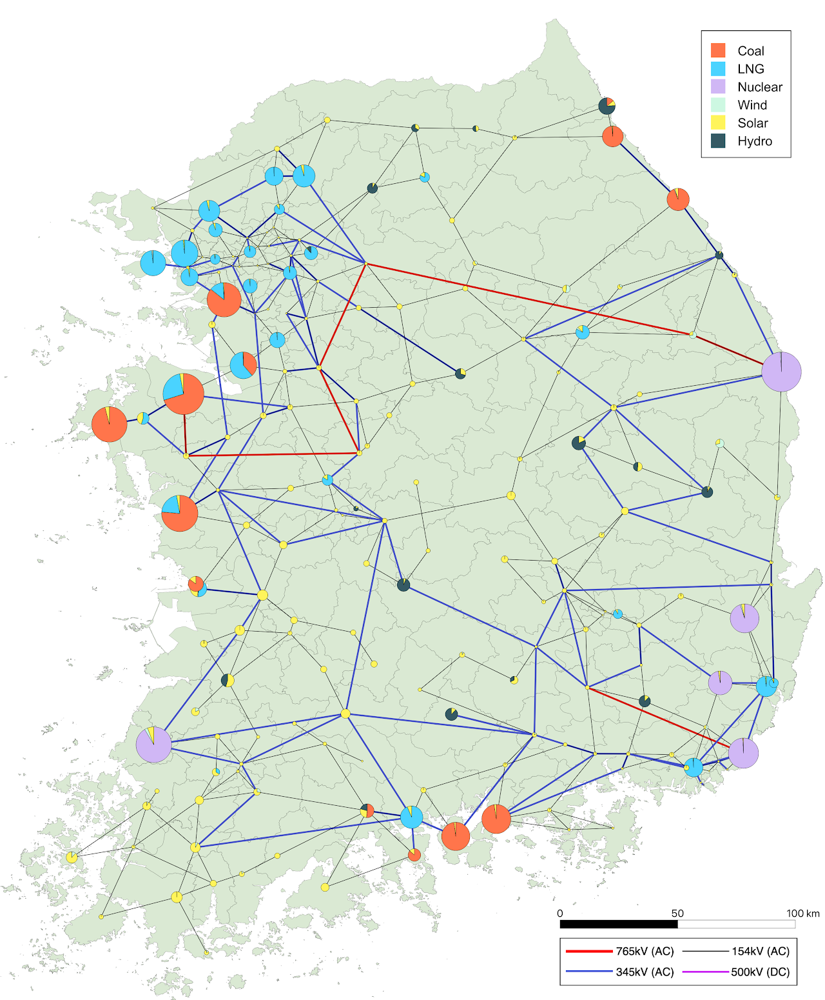

# KPG 193 Test System

KPG 193 is a synthetic Korean power grid test system developed using open data sources. It aims to provide a foundational framework for modeling and analyzing the Korean power grid.



## System Overview

The system includes:

- 193 buses with spatial information
- 122 conventional generators
- 359 transmission lines
- Capacity of renewable generators
- 8760-hour profiles for electrical demand, weather data, and renewable generators

## Documentation

For detailed documentation, tutorials, and additional resources, visit the [AGM Center Documentation](https://agm.kentech.ac.kr/documentation/kpg-test-system/).

## Citation

If you use the KPG 193 test system in your work, we kindly request that you cite the following paper:

```bibtex
@article{song2024kpg,
  title={KPG 193: A Synthetic Korean Power Grid Test System for Decarbonization Studies},
  author={Song, Geonho and Kim, Jip},
  journal={arXiv preprint arXiv:2411.14756},
  year={2024}
}
```

## License

The test system is made available under the [Open Database License (ODbL 1.0)](http://opendatacommons.org/licenses/odbl/1.0/).

## Contact

If you have any questions or suggestions, email us at: egolab.kpg@gmail.com

