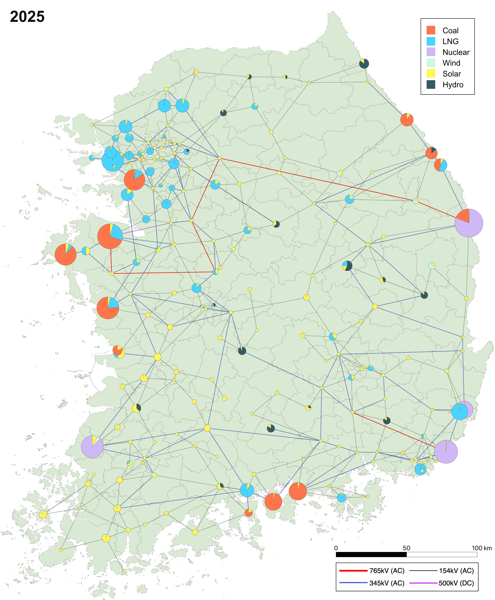

# KPG 193 Test System



*Network topology of the KPG 193 test system showing 193 buses across the Korean peninsula.*

## What is KPG 193?

KPG 193 is a **synthetic Korean power grid test system** developed by the [AGM Center](https://agm.kentech.ac.kr/) at [KENTECH](https://www.kentech.ac.kr/) from publicly available Korean energy data. It provides a standardized 193-bus representation of the Korean transmission network for reproducible power system studies.

KPG 193 is part of the [**KPG Test System**](https://agm.kentech.ac.kr/documentation/kpg-test-system/) module in the [**KPG (Korean Power Grid) Platform**](https://agm.kentech.ac.kr/documentation/introduction/). It is designed to work with [**KPG Run**](https://agm.kentech.ac.kr/documentation/kpg-run/user-interface/) for ED, UC, DC-OPF, and AC-OPF studies, and with [**KPG View**](https://agm.kentech.ac.kr/documentation/kpg-view/overview/) for map-based visualization.

The dataset supports research on decarbonization, optimal power flow, resource adequacy, reliability, and renewable energy integration. It is released under the Open Database License (ODbL 1.0) to support transparent and reproducible research.

## Key Features

- **MATPOWER-compatible**: Standard MATPOWER v2 case file for MATLAB, Octave, and MATPOWER-based tools.
- **Full temporal resolution**: 8,760 hourly data points for demand and renewable profiles.
- **Renewable capacity by bus**: Wind, solar, and hydro capacity data at each bus.
- **Network metadata**: Generator, pumped-storage hydro, and expansion metadata included.
- **Open and reproducible**: Released under ODbL 1.0 with transparent sourcing.
- **Versioned and maintained**: Regular updates with documented version history.

## System Overview

| Component | Count |
|-----------|------:|
| Buses | 193 |
| Conventional generators | 122 |
| Transmission lines (AC) | 359 |
| DC lines | 1 |
| Voltage levels | 154 / 345 / 765 kV |
| Renewable types | Wind, Solar, Hydro |
| Temporal resolution | 8,760 hours (24 h × 365 days) |

## Repository Structure

```
kpg193_v2_0/
├── network/
│   ├── m/
│   │   └── KPG193_ver2_0.m              # MATPOWER v2 case file
│   ├── mat/
│   │   └── KPG193_ver2_0.mat            # MATLAB MAT file
│   └── metadata/
│       ├── bus_metadata/
│       │   └── bus_metadata_2025.csv     # Bus geo-coordinates and names
│       ├── generator_metadata/
│       │   └── generator_metadata_2025.csv
│       └── psh_metadata/
│           ├── hydro_unit_metadata_2025.csv
│           ├── psh_child_metadata_2025.csv
│           └── psh_group_metadata_2025.csv
├── renewables_capacity/
│   ├── wind_generators_2025.csv          # Wind capacity by bus
│   ├── solar_generators_2025.csv         # Solar capacity by bus
│   └── hydro_generators_2025.csv         # Hydro capacity by bus
├── mustoff/
│   └── mustoff.csv                       # Generator must-off schedules
└── profile/
    ├── demand/
    │   └── demand_{1..365}.csv           # Hourly demand (P, Q) per bus
    ├── commitment_decision/
    │   └── commitment_decision_{1..365}.csv
    └── renewables/
        └── renewables_{1..365}.csv       # Hourly renewable generation ratios per bus
```

## Data Description

### Network Case File — `KPG193_ver2_0.m`

A standard MATPOWER v2 case file (`baseMVA = 100`) containing the following data structures:

| Structure | Description |
|-----------|-------------|
| `mpc.bus` | 193 buses with type, demand (Pd/Qd), voltage limits, base kV, and area |
| `mpc.gen` | 122 conventional generators with dispatch limits and voltage setpoints |
| `mpc.branch` | 359 AC transmission lines/transformers with impedance and rating data |
| `mpc.gencost` | Generator cost curves (polynomial format) |
| `mpc.genthermal` | Thermal generator parameters |
| `mpc.areas` | Area definitions with price reference buses |
| `mpc.dcline` | HVDC line data |
| `mpc.dclinecost` | HVDC line cost data |

### Bus Metadata — `bus_metadata_2025.csv`

| Column | Description |
|--------|-------------|
| `bus_id` | Bus number (1–193) |
| `Latitude` | Geographic latitude (WGS 84) |
| `Longitude` | Geographic longitude (WGS 84) |
| `name_Korean` | Bus name in Korean |
| `name_English` | Bus name in English |

### Renewable Capacity — `{wind,solar,hydro}_generators_2025.csv`

| Column | Description |
|--------|-------------|
| `bus_ID` | Bus number (1–193) |
| `Type` | Generator type (`Wind`, `Solar`, or `Hydro`) |
| `Pmax [MW]` | Maximum active power capacity |
| `Pmin [MW]` | Minimum active power output |

### Demand Profiles — `demand_{d}.csv`

One file per day (`d` = 1–365), each containing 24 × 193 rows.

| Column | Description |
|--------|-------------|
| `hour` | Hour of the day (1–24) |
| `bus_id` | Bus number (1–193) |
| `demandP` | Active power demand (MW) |
| `demandQ` | Reactive power demand (Mvar) |

### Renewable Profiles — `renewables_{d}.csv`

One file per day (`d` = 1–365), each containing 24 × 193 rows. Values represent normalized generation ratios (0–1) relative to installed capacity.

| Column | Description |
|--------|-------------|
| `hour` | Hour of the day (1–24) |
| `bus_id` | Bus number (1–193) |
| `pv_profile_ratio` | Solar PV generation ratio |
| `wind_profile_ratio` | Wind generation ratio |
| `hydro_profile_ratio` | Hydro generation ratio |

## Getting Started

### 1. Download the Data

Clone this repository:

```bash
git clone https://github.com/agm-center/kpg-testgrid.git
cd kpg-testgrid
```

### 2. Load in MATLAB / Octave

Add the case file to your MATLAB path and load it directly:

```matlab
addpath('kpg193_v2_0/network/m');
mpc = KPG193_ver2_0;

% Run a power flow
results = runpf(mpc);

% Run an optimal power flow
results = runopf(mpc);
```

### 3. Load in Python

Use pandas to work with the CSV data:

```python
import pandas as pd

# Load bus locations
buses = pd.read_csv('kpg193_v2_0/network/metadata/bus_metadata/bus_metadata_2025.csv')

# Load renewable capacity
wind = pd.read_csv('kpg193_v2_0/renewables_capacity/wind_generators_2025.csv')
solar = pd.read_csv('kpg193_v2_0/renewables_capacity/solar_generators_2025.csv')

# Load a single day's demand profile (e.g., day 1)
demand = pd.read_csv('kpg193_v2_0/profile/demand/demand_1.csv')

# Load all 365 days into one DataFrame
demand_all = pd.concat(
    [pd.read_csv(f'kpg193_v2_0/profile/demand/demand_{d}.csv').assign(day=d)
     for d in range(1, 366)],
    ignore_index=True,
)
```

To load the MATPOWER case file in Python, you can use [oct2py](https://oct2py.readthedocs.io/) (requires GNU Octave):

```python
from oct2py import octave
octave.addpath('kpg193_v2_0/network/m')
mpc = octave.KPG193_ver2_0()
```

## Data Sources

For a detailed description of the data construction methodology, see the accompanying paper [https://arxiv.org/abs/2411.14756](https://arxiv.org/abs/2411.14756).

## Version History

| Version | Updated | Major changes |
|---|---|---|
| **v2.0** | 2026-06 | system-demand-based profiles; refined generator parameters; expanded metadata incl. pumped storage |
| **v1.5** | 2025-12 | Generator locations corrected |
| **v1.4** | 2025-09 | Bus numbering standardized; clustering improved |
| **v1.3** | 2025-07 | Renewable profiles fixed |
| **v1.2** | 2025-02 | Generator costs and capacities updated |
| **v1.1** | 2024-12 | Slack bus changed |
| **v1.0** | 2024-11 | Initial public release |

## Citation

If you use the KPG 193 test system in your work, please cite:

```bibtex
@article{song2024kpg,
  title={KPG 193: A Synthetic Korean Power Grid Test System for Decarbonization Studies},
  author={Song, Geonho and Kim, Jip},
  journal={arXiv preprint arXiv:2411.14756},
  year={2024}
}
```

## Documentation

For documentation, tutorials, and additional resources, visit the [AGM Center Documentation](https://agm.kentech.ac.kr/documentation/kpg-test-system/).

## License

The test system is made available under the [Open Database License (ODbL 1.0)](http://opendatacommons.org/licenses/odbl/1.0/).

## Contact

For questions or suggestions, contact: egolab.kpg@gmail.com
